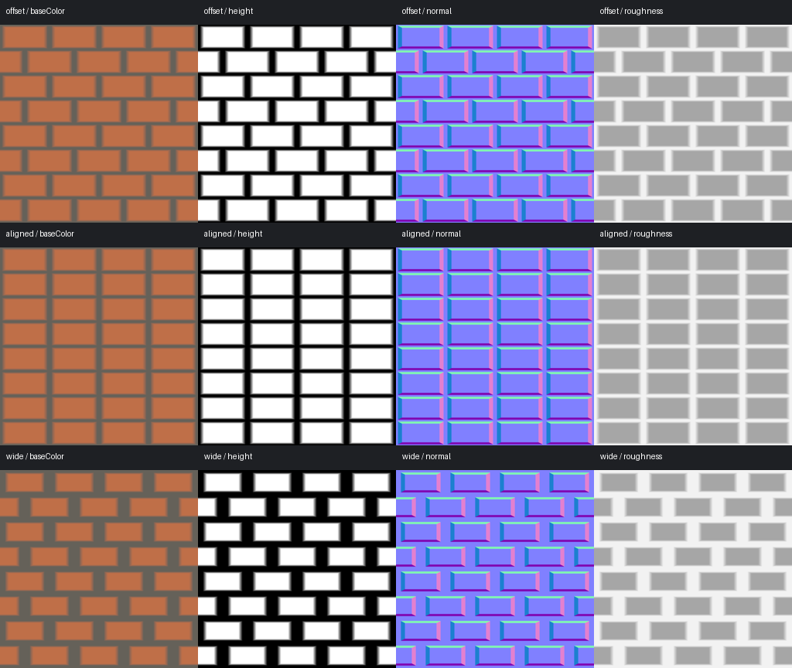
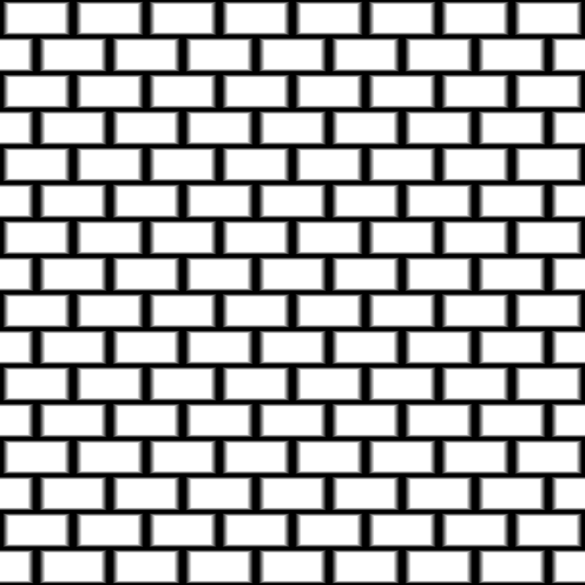

# Brick pattern local visual review

English | [简体中文](./README.zh-CN.md)

These are local Windows hardware previews from the new brick graph, not accepted cross-runtime or archive qualification. [Receipt](./local.json) records the graph hash, selected adapter, plan identities and twelve original PNG hashes. The source contract and exact generation commands are in the [node guide](../../brick-pattern.md). The three variants use defaults, layout=aligned and gap=0.2 at 1024x1024, requesting baseColor,height,normal,roughness.

Agent review: brick courses alternate only in the offset variants; mortar is dark in height and has neutral normals away from bevels. Increasing gap visibly reduces the brick plateau. Normal edge colors follow the shared height boundaries. The image is a procedural geometric foundation, not a photorealistic brick material. Contact panels are resized to 256x256; inspect the retained original PNGs for numerical work. Maintainer visual approval and software/browser release qualification are not claimed.

The tiled image repeats a 512x512 display reduction of the default height. Separate GPU tests compare the complete doubled-resolution/doubled-cell output to four original tiles byte for byte; the preview alone is not that proof. Original and migrated historical material goldens are unchanged.
