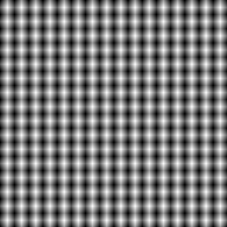
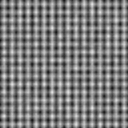
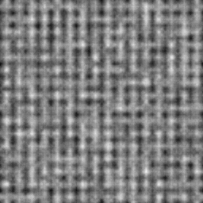
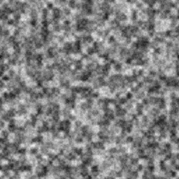
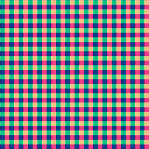
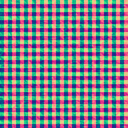
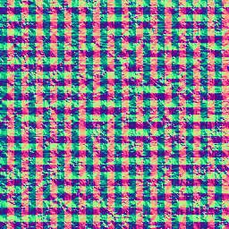
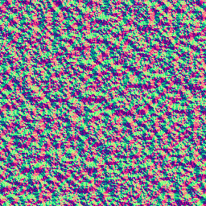

# M6A-03 Native 证据

[English](./README.md) | 简体中文

[实现记录](../../m6a-03-native-resources.zh-CN.md)定义范围及复现步骤。本地 Windows／NVIDIA GeForce GT 1030 Vulkan 执行覆盖固定图像测试，包括精确字节渐变、填充、共享 ID、混合及生命周期门槛。这是特定主机证据，不代表普遍硬件支持；固定 SwiftShader 结果在 PR 检查后另行记录。

[运行记录](./run.json)绑定 110 个源码／输入文件、实际适配器、22 个执行用例、描述符测量、计划身份及图像摘要。源码是基于所记录 M6A-02 提交的未提交工作树，以文件哈希确定实际测试内容。代理视觉审查与维护者验收分别表述。

选定联系表各列权重为 0、0.25、0.5、1，上排高度，下排法线。各块从 1K 最近邻采样为 256×256，不调色。先运行 `cargo xtask test-node image-input`，再运行 `node scripts/image-resource-contact.mjs tmp/node-tests/auto <output.png> docs/evidence/m6a-03` 复现。

| 高度／法线 | 0 | 0.25 | 0.5 | 1 |
|---|---|---|---|---|
| height |  |  |  |  |
| normal |  |  |  |  |

完成的运行记录保留源码身份、测量及选定视觉内容。完整重复日志与原始 RGBA 保留于忽略目录或有限期 CI 产物。不声明浏览器图像执行或 M6A-05 发行资格。
