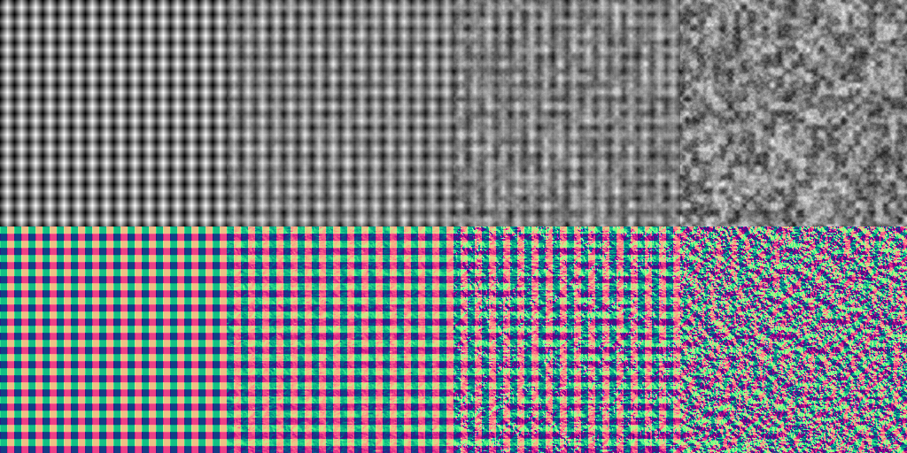

# M6A-05 comprehensive qualification

English | [简体中文](./README.zh-CN.md)

M6A-05 qualifies the **recorded Linux software matrix** for the M6-A resource increment. The [acceptance receipt](./acceptance.json) binds PR #36 head `6e6af1872a7111263815a70ab54ad35009c9326a`, its tested integration commit `9dae2dff21958ac117504ab968a264cd900ae4bb`, six successful required checks, and the exact unpublished 0.3.0-alpha.0 archive. This evidence-only change does not claim that its later commit was the source of those pixels. Integration of the stacked implementation PRs and publication remain separate.

## Decisive results

| Gate | Result and retained evidence |
|---|---|
| Public candidate / published baseline | [Candidate](./candidate.json): 13 tests, no skips/flakes/failures; [registry](./registry.json): nine tests against the separate published 0.2.0-alpha.0 identity |
| Resource Native/browser parity | [Resources](./resources.json): four frozen 1K weights × height/normal, all eight comparisons **max delta 0**, equal plan hashes, owned output after destruction; [browser measurements](./browser-resources.json) |
| Upload/lifetime | One selected resource, 4,194,304 packed upload bytes and zero live descriptor bytes after each 1K render; Native source/archive image probes and failure cleanup are also exercised by the required GPU check |
| Scalar regression | [Scalar](./scalar.json): four weights × two channels pass the unchanged ≤1 gate |
| Existing materials | [Material comparison](./materials.json): 11 cases / 44 channels across glazed ceramic, leather and wood pass existing semantic, structural, numerical and regression gates; [outer product verifier](./product.json) binds the candidate and normal deployment |
| Platform and package checks | The six named successful checks and job URLs are retained in the receipt: Linux/macOS/Windows CPU, pinned Native SwiftShader GPU/package/materials/2K trace, WASM/npm, and Chromium matrix |

The candidate archive SHA-256 is `464540b5af7913629213f6d20df7f0b7f41acee2287334819bbf2b325c5e65e5`; it was recomputed from the retrieved archive and matched both public-consumer and [build](./build.json) receipts. Native uses pinned SwiftShader revision `694585a05946e1ed49b6bd577ca6537cbb57f025`; Chromium uses its explicitly requested software adapter. CPU success on macOS/Windows is not GPU qualification there.

## Visual review and retained failure



Columns are weights 0, 0.25, 0.5 and 1; rows are height and normal. Each 1K output is sampled at `(4*x,4*y)` into a 256×256 panel, without color adjustment. Codex inspected this sheet: imported periodic ridges remain apparent at intermediate weights while procedural detail increases; height and normal change together and neither endpoint is blank. This is **agent visual review**, not an assertion of maintainer approval. Machine tests establish exact orientation, byte-ramp correctness, endpoints, seams and parity; the preview alone cannot establish these properties. The receipt binds the reviewed image and all eight original PNG identities.

Windows NVIDIA GeForce GT 1030 Vulkan versus ordinary Chrome remains **not qualified**. The [original source/archive provenance](../m6a-04/windows-hardware-failure.json) and promoted [complete Native failure report](./windows-failure.json) retain all eight comparisons and worst-pixel values. Normal maximum deltas at weights 0 / 0.25 / 0.5 / 1 are 0 / 1 / 4 / 8. Each runtime's weight-1 result equals its direct procedural-noise endpoint, so this discrepancy also exists without imported height contributing to the output. This localizes the acceptance blocker to the procedural path or backend arithmetic; it does not prove an exact compiler/driver cause. No shader, golden, fixture or threshold was changed to close M6A-05.

The [resource contract](../../m6a-resource-contract.md) now explicitly bounds milestone closure to the recorded software matrix. The ≤1 comparison remains mandatory for each environment that is claimed as qualified. Expanding to this Windows hardware pair requires a separately reviewed numerical fix/version decision and rerunning the frozen resource, Scalar and material gates; the existing failure must not be relabelled as passing.

## Reproduction and retention

Check out the recorded integration commit (or build a new revision and retain its distinct identity). Follow the [browser material workflow](../../../.github/workflows/browser-materials.yml) to install the pinned Native software adapter, exact toolchain and Chromium software flags. Run `cargo xtask check`, `cargo xtask test-node image-input` and `cargo xtask gpu-smoke`; the latter includes source and packaged public consumers and material gates. Then:

```sh
node scripts/browser-runtime/build.mjs
node scripts/browser-runtime/consumer.mjs candidate target/browser-runtime tmp/sdk-candidate
node scripts/browser-runtime/check-resources.mjs tmp/sdk-candidate tmp/sdk-resource-comparison
node scripts/browser-runtime/check-scalar.mjs tmp/sdk-candidate tmp/sdk-scalar-comparison
node scripts/browser-runtime/consumer.mjs registry - tmp/sdk-registry
```

Use fresh output directories. The remainder of the linked workflow runs the pinned disposable product's material and normal-deployment gates; do not modify Studio. Required CI retains exact commands and full run outcomes. The contact sheet can be reproduced by decoding the eight `resource-<weight>-<channel>.png` files in `tmp/sdk-resource-comparison`, selecting every fourth pixel from the top-left, and arranging the panels in the order above.

The browser artifact is `chromium-material-matrix`, ID `10637705492`, run [35596753957](https://github.com/OpenMixture/OpenMixture/actions/runs/35596753957), expiring **2026-10-21**. Its extracted candidate archive was independently hashed; the ZIP digest in the receipt is GitHub-reported. Git retains selected original reports, the reviewed contact image, source/package identities and the failure used to bound acceptance. Full 1K originals, archive bytes and routine logs have finite CI retention and temporary local copies, not a durable full-run archive. After expiry the retained measurements/contact remain inspectable, but hashes cannot recover the original archive or full-resolution pixels.

Out of scope: hardware parity repair, shader semantics, new nodes, CLI decoding, packaging, Studio work, Rust/npm publication and merging dependent PRs.
