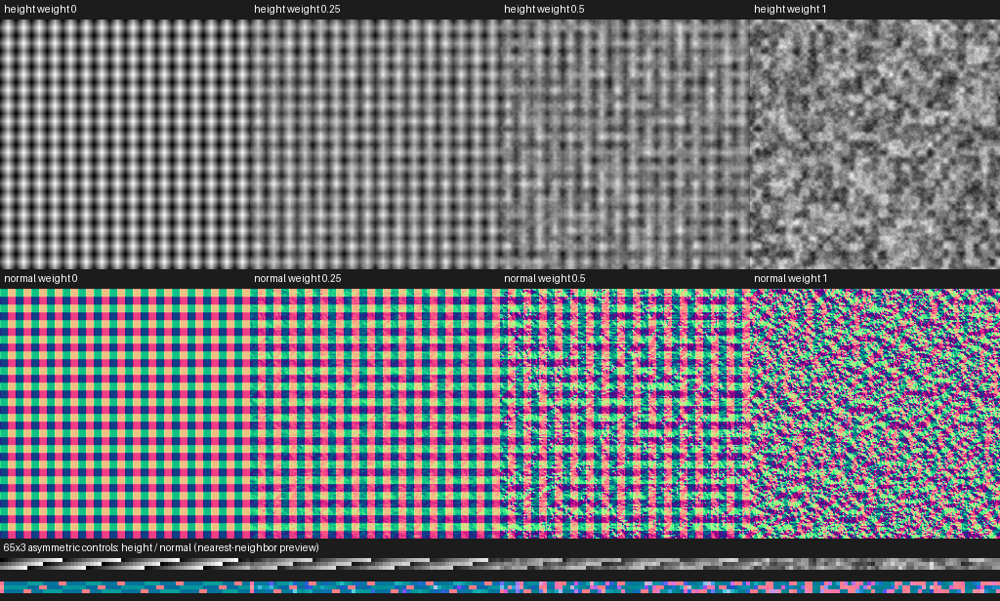

# M6B-05 comprehensive qualification

English | [简体中文](./README.zh-CN.md)

M6-B implementation and qualification are complete **within the recorded Linux software matrix**. [Acceptance](./acceptance.json) binds [PR #45](https://github.com/OpenMixture/OpenMixture/pull/45) head `92e1a5c7e671595eac57d3b62d5fbaa48d7c9e19`, tested integration `189059f7eca172c8179f416f404f9418a08e3e1d`, six successful required checks and the exact unpublished 0.5.0-alpha.0 npm archive. This later evidence/docs commit is not the source of those pixels. The milestone stack remains unmerged and publication is separate.

| Gate | Result |
|---|---|
| Candidate / registry | [Candidate](./candidate.json) 16/16; [registry](./registry.json) 13/13 on separate published 0.3.0-alpha.0; no skips/flakes/failures |
| Package/loose equivalence | 1024×1024 and asymmetric 65×3, four weights, height/normal: exact same-runtime plan/pixel identity, two reloads per case, rejection recovery and output ownership after destruction |
| Native/browser | [Assets](./assets.json) and [browser measurements](./browser-assets.json): all 16 channel comparisons have **maximum delta 0**, matching package and plan identities |
| Native source/archive | [Source](./native-source.json) and [packaged](./native-packaged.json) run all eight cases; zero live per-call GPU bytes; [four isolated Cargo archives](./cargo-packages.json) and moved-asset CLI consumption pass |
| Existing regressions | [Scalar](./scalar.json), [resources](./resources.json), [three materials](./materials.json): 11 cases / 44 channels; [product/deployment verifier](./product.json) passes without modifying Studio |
| Required checks | Linux/macOS/Windows CPU, pinned SwiftShader GPU/materials/packages/2K trace, WASM/npm and Chromium matrix all pass; exact job URLs/times retained in acceptance |

The retrieved npm archive SHA-256 is `c1593834217d7a50e1a8abf72cf18937d6ec7350a45495755fbaaae17a1a8f81`, independently recomputed and matched to the [build receipt](./build.json). Native uses pinned SwiftShader revision `694585a05946e1ed49b6bd577ca6537cbb57f025`; browser Chromium 153.0.8010.12 explicitly selects SwiftShader. Existing `.mix v1`, package v1, plan v2, API schema 2 and fractal-noise v1 are unchanged. CPU platform checks do not imply GPU acceptance on those platforms.

Columns are weights 0/0.25/0.5/1, rows height/normal. The 1K panels sample exact source pixels at `(4x,4y)`; the bottom strips show nearest-neighbor rectangular previews. Codex inspected the retained sheet: periodic imported structure remains visible at intermediate weights, procedural detail increases, height and normal vary together, and endpoints are nonblank. This is agent visual review, not maintainer approval. Exact numerical tests establish package equivalence and orientation; the preview cannot establish those alone. Contact and all 16 original PNG hashes are bound in acceptance. No shader/golden changes were accepted.

Windows NVIDIA GT 1030 DX12 versus installed Chrome remains **not qualified for cross-runtime normal parity**. The [complete new failure](./windows-failure.json) records 1K normal maxima 0/1/4/8 at weights 0/0.25/0.5/1; 65×3 comparisons are all zero. [Windows candidate](./windows-candidate.json) passes 16 tests, including exact package/loose pixels in that runtime. Native also passes exact package/loose pixels. The failure reproduces the existing procedural/backend limitation; it does not prove a driver/compiler cause. The ≤1 gate, source versions and [historical failure](../m6a-05/README.md) remain unchanged. NUM-01 repair and hardware expansion are separate.

## Reproduction and retention

Follow the [qualification guide](../../m6b-05-qualification.md) and [browser workflow](../../../.github/workflows/browser-materials.yml), with a clean checkout, fresh output directories, pinned software adapter and the exact candidate archive. Run `cargo xtask check`, `cargo xtask gpu-smoke`, the public candidate/registry consumers, `compare-assets.mjs`, Scalar/resource comparison and the existing material/deployment gates. The fixture generator is consumer-owned and imports only public Rust APIs. Rebuilding produces a new receipt; do not relabel it as this original run.

Browser artifact `chromium-material-matrix` ID `10687810595` and GPU artifact `swiftshader-material-evidence` ID `10688180687` expire **2026-10-22**; service metadata/digests are retained. Git keeps decisive original reports, reviewed contact, failure and source/package identities. Full PNG originals, npm/Cargo archive bytes and routine logs have finite CI retention and ignored local copies, not a permanent full-run archive. Their hashes cannot recover expired bytes. No universal platform promise, release publication or stack merge is implied.
