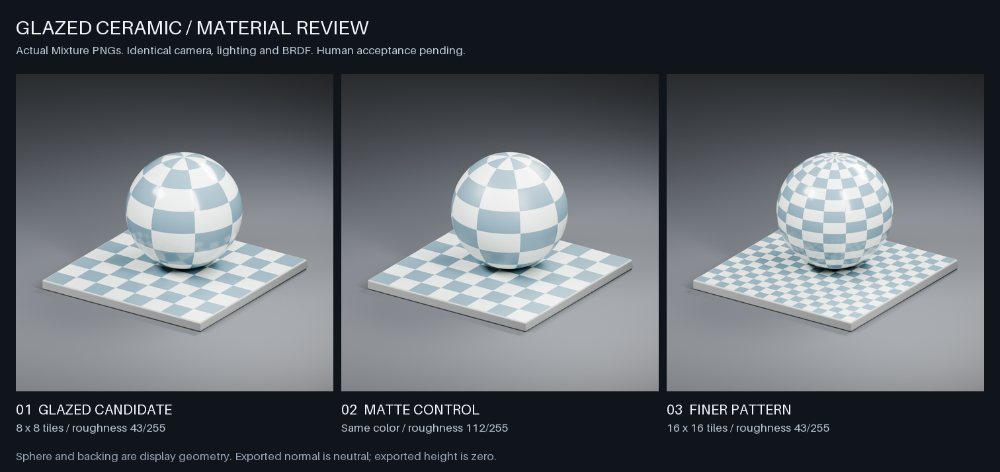
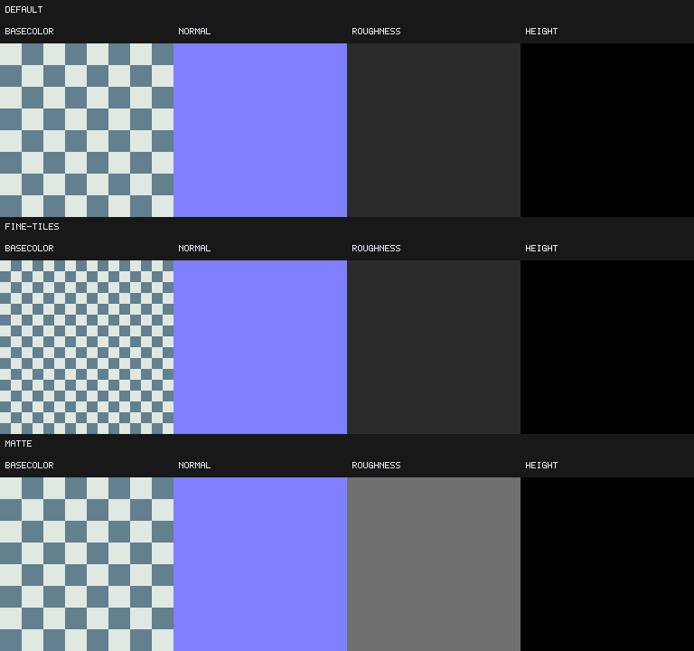
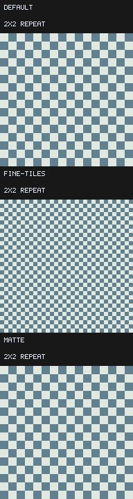

# PR-008 本地证据

[English](./README.md) | 简体中文

当前 1K 夹具共十二张请求 PNG：默认、细格和哑光三个用例，各含 baseColor、normal、roughness 和 height。在所测适配器上全部机器验收通过。针对平面棋盘预览的反馈，现已用受控 PBR 图展示真实通道的光照响应。[human-review.json](./human-review.json)保留原反馈，记录用户对修订证据的明确**接受**；输入清单没有改变。本项工作不宣称远端 CI 或完整 M3 已关闭。

| 证据 | 结果 |
| --- | --- |
| [仓库验证](./verification.json)、[完整检查日志](./repository-check.log) | 基准／保护及回读专项测试、全部材质检查和 `cargo xtask check` 在本地通过。 |
| [软件比较](./software.json)、[doctor](./software-doctor.json) | 固定 SwiftShader `694585a05946e1ed49b6bd577ca6537cbb57f025`，Vulkan，Darwin／arm64。十二张输出全部与初始基准精确一致。 |
| [硬件比较](./metal.json)、[doctor](./metal-doctor.json) | Apple M5，Metal。每个用例／通道的最大 RGBA8 误差、平均误差及变化像素比例均为 0。阈值仍为最大 1、平均 0.25、无像素超过 1；精确一致是本次观察，不是跨平台承诺。 |
| [初始渲染](./bootstrap-render.json) | 机器验收通过；因不存在旧材质基准，比较明确返回失败。 |
| [显式初始接受](./bootstrap-acceptance.json)、[绑定候选](./bootstrap-candidate.json) | 独立运行 `golden update glazed-ceramic --accept`，不渲染、不暂存、不提交。旧基准为空，这是建立新材质参考，不是重置失败的已有基准。 |

每个用例为八个计算 pass、75,497,648 逻辑峰值字节。细格改变 50% 的 baseColor 像素，其余通道不变；哑光将全部粗糙度像素由 43 升至 112，颜色／法线／高度不变。交替占比精确平衡，两个格子的周期误差和额外环绕边界误差均为零。现有渲染器在编码前强制检查浮点有限值与范围。报告中的时间为 CPU 墙钟时间，不是 GPU 时间戳。

## 审查图

从左至右：默认亮面候选、哑光对照、细格图案。球体与样板使用真实导出的 baseColor、normal、roughness、height；三版共用光照、相机、曝光及 BRDF。默认与细格版保留较窄的灯光反射和较清晰的样板倒影；哑光版的反射扩散且模糊。球体及圆角底座属于消费端几何体，不是生成的表面细节。细小颗粒来自 Cycles 采样噪声，不是贴图微结构。用户已接受此范围内的陶瓷观感。对照图的待审标签反映生成时的状态，以已签署的 JSON 记录为准。

完整图：[默认](./pbr/default.png)、[哑光](./pbr/matte.png)、[细格](./pbr/fine-tiles.png)。[PBR 报告](./pbr/review.json)记录 Blender 4.5.13／Cycles／Apple M5 Metal、512 个样本、全部输入哈希与场景脚本哈希；[对照记录](./pbr/comparison.json)绑定展示图。[渲染日志](./pbr/render.log)及[输入保护测试](./pbr/input-tests.log)保留执行证据。使用[可选离线评审脚本](../review/README.zh-CN.md)复现。生成这些展示图时，没有改变材质 PNG 或已有基准。

原有平面通道证据仍用于检查编码和平铺：

列依次为 baseColor、normal、roughness、height；行依次为默认、细格、哑光。标量／法线字节在此 sRGB 对照图中是诊断色块，[原始 PNG 元数据](../expected/)仍为权威输出。

初始前／后／差异图明确标记旧基准缺失：

- [默认](./initial-contact-default.png)
- [细格](./initial-contact-fine-tiles.png)
- [哑光](./initial-contact-matte.png)

比较图列依次为修改前、修改后、放大四倍的差异：

- 软件：[默认](./software-contact-default.png)、[细格](./software-contact-fine-tiles.png)、[哑光](./software-contact-matte.png)。
- Metal：[默认](./metal-contact-default.png)、[细格](./metal-contact-fine-tiles.png)、[哑光](./metal-contact-matte.png)。

黑色差异面板表示没有分量变化，不是没有渲染；初始图的斜线面板表示比较数据缺失。智能体检查与人工决定分开记录。人工接受时需注明审查者身份，并针对当前清单及 PBR 报告摘要记录决定；任何基准或场景更新后都应更新对应审查记录。

使用[材质命令](../README.zh-CN.md)及[基准工作流](../../../../docs/material-goldens.zh-CN.md)复现。报告中的绝对路径和时间戳是历史执行证据，新运行会创建自己的本地路径。不在范围内：自动代替人工批准、新节点／着色器、写实表面细节声明、2K／优化、浏览器及远端 CI 验收。
